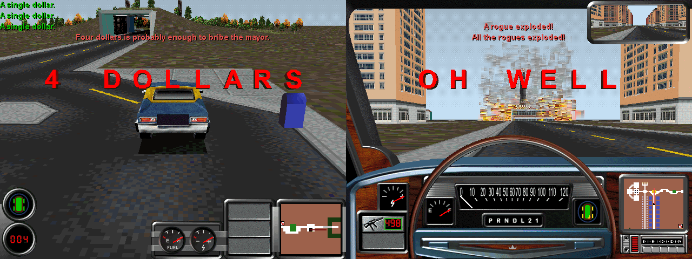

The results of my work to reverse-engineer the scenario files used by [Streets of SimCity](https://en.wikipedia.org/wiki/Streets_of_SimCity).

* The `docs` folder contains [`Streets-of-SimCity-Scenario-Format.md`](docs/Streets-of-SimCity-Scenario-Format.md), which describes the binary scenario format.
* The `scripts` folder contains Python scripts for scenario creation and analysis.
  * The `scripts/analysis` folder contains scripts to print out the AI, event, and package definitions contained in the scenarios included with Streets of SimCity. I used these scripts while reverse engineering the scenario format.
  * The `scripts/scenario-creation` folder contains:
    * Several Python modules containing classes to generate the various scenario file sections.
    * [`GenerateCustomScenarioDemo.py`](scripts/scenario-creation/GenerateCustomScenarioDemo.py): a script that creates a custom scenario using the aforementioned classes. **If you want to create your own scenarios, I recommend using this script as a guide.**
    * `CustomScenarioDemo.scn` and `CustomScenarioDemo.sc2`: the custom scenario demo generated by `GenerateCustomScenarioDemo.py` and the SimCity 2000 city file it requires. To play this scenario, place the `.scn` file in Streets' `scenarios/Movie` folder and the `.sc2` file in its `Cities` folder.

