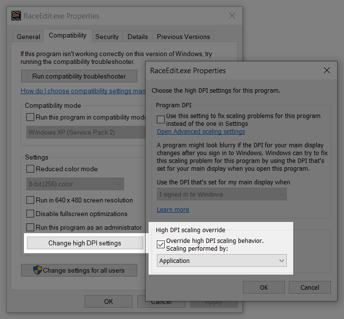
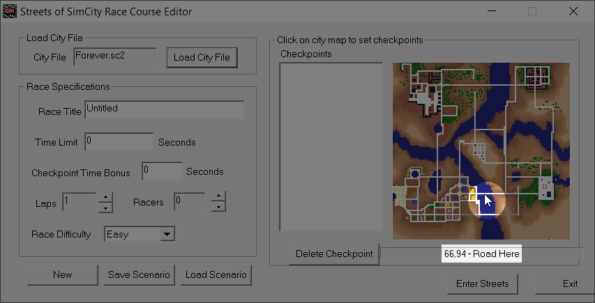
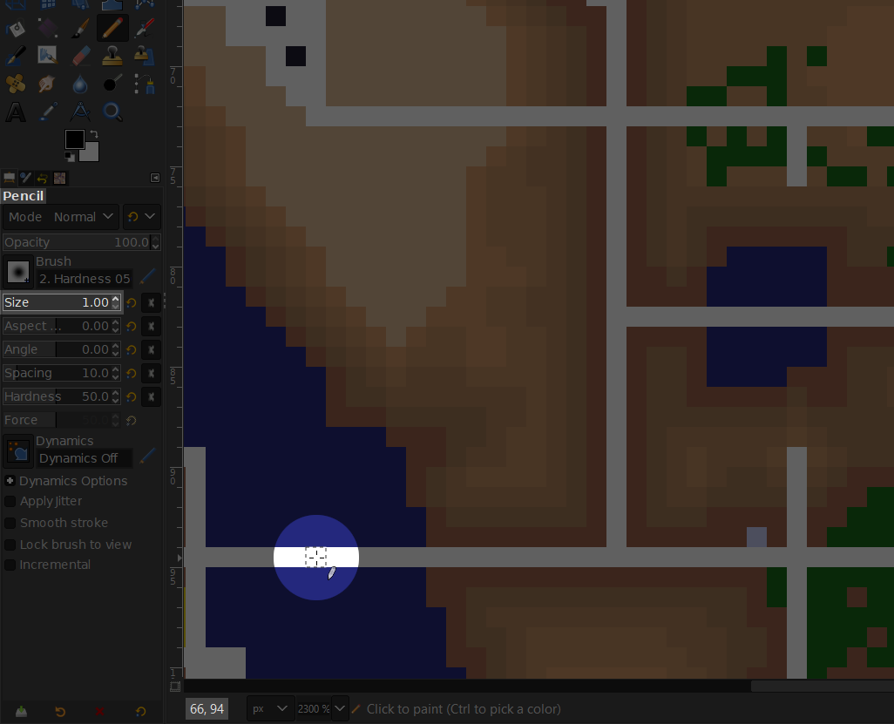

# Getting Map Coordinates

A key part of scenario creation is specifying the coordinates of locations within a SimCity 2000 map. This document describes how to obtain coordinates by using RaceEdit (included with Streets of SimCity) and image editing software.

## Process

1. Check that RaceEdit (`RaceEdit.exe`) is working. If you're using [SimStreetsX](http://streetsofsimcity.com/), you may need to manually copy it from the `exe` folder to the parent Streets directory (originally, this would have been done by the Streets installer).
1. Right-click on `RaceEdit.exe`, select *Properties*, select the *Compatibility* tab, and press the *Change high DPI settings* button.
1. Check the *Override high DPI scaling behavior* checkbox and select *Application* from the dropdown menu. Save the changes. This ensures that RaceEdit won't be blurry.

1. Run RaceEdit and load a SimCity 2000 file (it must be within the `Cities` directory).
1. Note that coordinates can be obtained by moving the mouse cursor over the image of the map. This may suffice, but it's difficult to be precise using this method as the city image is only 256x256 pixels.

1. Take a screenshot and open it with your choice of image editing software (I recommend [the GNU Image Manipulation Program](https://www.gimp.org/)).
1. Crop the screenshot to the extent of the map image. Note that the map image is surrounded by a one-pixel-thick white border: don't crop it out as it's actually rendered inside the map. If the resulting image is 256x256 pixels you've cropped it correctly.
1. Rescale the image to 128x128 pixels with interpolation set to nearest-neighbor/none.
1. You can now zoom in on the image and use any tool that reports its position in pixels to obtain map coordinates. Be sure to check whether the reported position is zero-based or one-based; if it's the latter, subtract one from the coordinates before using them in a scenario. Any sort of hard-edged (aliased), one-pixel-large pencil tool that highlights the pixel under the cursor will work well.

