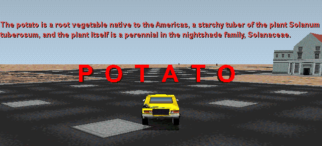
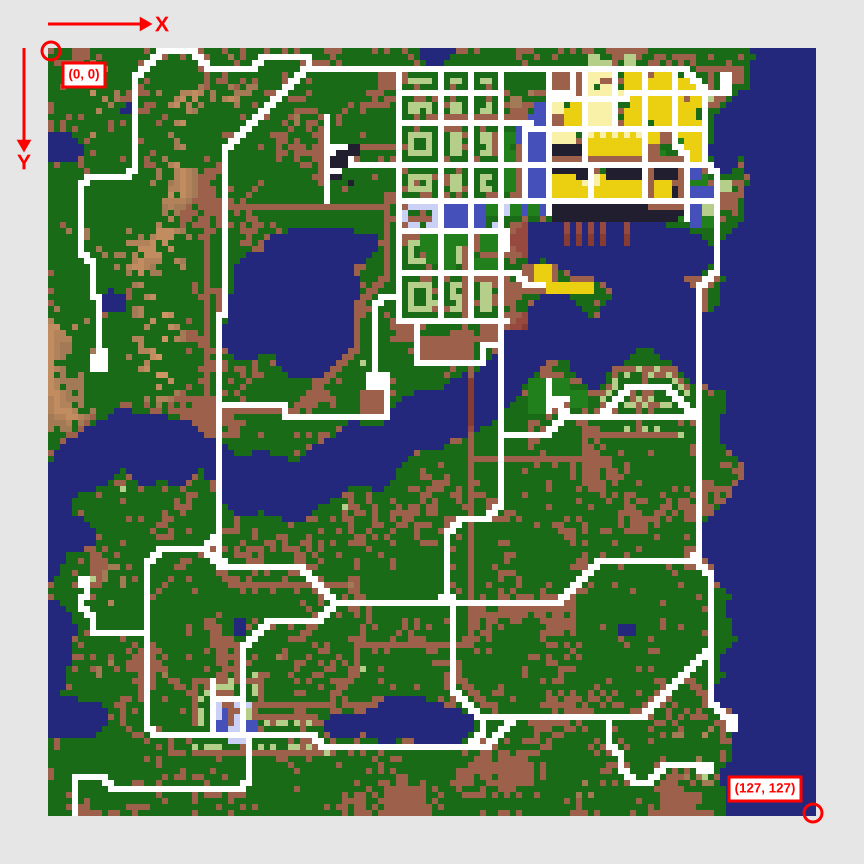

# Streets of SimCity Scenario Format

This document describes the format of the scenario files (`.scn`) used by 1997 Maxis game [Streets of SimCity](https://en.wikipedia.org/wiki/Streets_of_SimCity), which I've reverse-engineered using a hex editor ([HxD](https://mh-nexus.de/en/hxd/)), [SimStreetsX](http://streetsofsimcity.com/), and too much free time (courtesy of COVID-19).

## Terms
The following terms are used in this document:
* Message text: text that appears during a mission, usually in the top-left of the screen (although optionally centred). Green if associated with a package, red otherwise.
* Dramatic text: text that is rendered in the centre of the screen using large red letters. Each letter is a 3D model. This text enters and leaves the screen using a randomly-selected transition animation. Dramatic text longer than 11 characters will be truncated.

## General Notes

* The scenario file format is very similar to [Interchange File Format](https://en.wikipedia.org/wiki/Interchange_File_Format): it contains a variable number of named sections/chunks.
* The first eight bytes of each section contain the reversed four-letter section name (e.g., CITY is written YTIC) followed by the length of the section in bytes. All section lengths include the four bytes containing the section name.
* All numeric values are little-endian.
* All temporal values are specified in seconds.
* All monetary values are specified in dollars.
* Message text uses `\c` to indicate that text should be centred and `\n` for a newline. Sentences on the same line are usually separated by two spaces (a convention for monospaced text, albeit one that's less common now than it once was).
* Left-aligned message text longer than roughly 90 characters goes beyond the right edge of the screen. Text isn't automatically wrapped; newlines must be included explicitly.
* When coordinates are specified, the top-left corner of the map is the origin. The x axis increases going right/east and the y axis increases going down/south. Coordinates are zero-based.
  * Note that this differs from the coordinate system used in SimCity 2000 (the origin is the same, but the X and Y axes are swapped).
  * The RaceEdit program included with Streets of SimCity is a convenient way to obtain coordinates.

### Coordinate System
This image shows the coordinate system in the context of `Granny123.sc2`, the city used for the first three missions of the *Granny's Wild Ride* campaign. The city image is from RaceEdit.

## Event Overview

* Streets of SimCity scenarios use events and event groups to manage objectives, instructions, and the creation of vehicles and packages.
* Events are triggered by something happening. There are five event types:
  * Type 0: player kills a given number of AI vehicles of a given type.
  * Type 1: player reaches a location.
  * Type 2: player delivers a given number of packages.
  * Type 3: player earns a given amount of money.
  * Type 4: a rogue explodes.
* Each event can be triggered either a finite or infinite number of times.
* Each event is associated with an event group and multiple events can be associated with the same group.
* An event group is triggered when all the events associated with it have occurred as many times as they can.
  * If an event group is associated with one or more events that can occur an infinite number of times, the group will never be triggered.
* Event groups can optionally cause the player to win or lose the mission when they occur.
* Event groups can optionally trigger the "nuclear explosion" effect (the game freezes for a few seconds while an explosion sound plays and the screen turns white and shakes) when they occur.
* AI vehicles and packages can optionally spawn when a certain event group is triggered. This is specified in the AI and package definitions.
* Any event can have an objective label, but it will only be shown in the objective screen (which appears when the F3 key is held) if the event is part of an event group that causes the player to win the mission.
  * When retrieving the label for a mission-win event, Streets of SimCity uses the *i*th label for the *i*th event. This means that empty labels are required for events that aren't associated with the mission-win group (to fill the gaps between the labels for mission-win events).
  * If no label is specified for a mission-win event or its label is empty, Streets will generate a label for it.

### Event Management

* Type 1 events that are part of the mission-win group block all type 1 events (regardless of group association) that come after them in the list of events (i.e., those type 1 events cannot occur until the mission-win type 1 event before them does).
* A mission-win type 1 event cannot occur until all events that precede it in the list of events and satisfy either of these criteria have occurred:
  * The event is in the mission-win event group.
  * The event is a type 1 event.
* A mission-win event that isn't type 1 will only have its label shown in the objective screen once all mission-win type 1 events before it have occurred. However, it can occur at any time.

# File Sections

## File Signature (MIFF)

Quantity: 1

Offset | Type | Length | Description
---|---|---|---
0 | Char | 4 | File signature (MIFF)
4 | ? | 4 | Unknown. Always 2.

### Notes
* MIFF likely stands for Maxis Interchange File Format.

## Miscellaneous Data (SCED)

Quantity: 1

Offset | Type | Length | Description
---|---|---|---
0 | Char | 4 | Name (DECS)
4 | Char | 4 | Unknown. Always CSTS.
8 | ? | 4 | Unknown. Always 100.
12 | Int | 4 | File size in bytes. Appears to be used only for memory allocation (if at all) as a value larger than the actual size seems to cause no problems.
16 | ? | 4 | Unknown. Always 1.

### Notes
* SCED may stand for SimCity Editor Data.
* CSTS is STSC reversed; the latter probably stands for STreets of SimCity.

## City Filename (CITY)

Quantity: 1

Offset | Type | Length | Description
--- | --- | --- | ---
0 | Char | 4 | Name (YTIC)
4 | Int | 4 | Length
8 | Char | >5 | Null-terminated string containing city filename (including `.sc2` extension)

### Notes
* The specified SimCity 2000 file must be present in the `Cities` folder.

## Scenario Name (NAME)

Quantity: 1

Offset | Type | Length | Description
--- | --- | --- | ---
0 | Char | 4 | Name (EMAN)
4 | Int | 4 | Length
8 | Char | >0 | Null-terminated string containing scenario name

### Notes
* Appears in the menu.
* Can be empty.

## Time Limit (TIME)

Quantity: 1

Offset | Type | Length | Description
--- | --- | --- | ---
0 | Char | 4 | Name (EMIT)
4 | Int | 4 | Length (always 12 = 0x0C)
8 | Int | 4 | Time limit (0 = no limit)

## Checkpoint Bonus Time (CHKB)

Quantity: 1

Offset | Type | Length | Description
--- | --- | --- | ---
0 | Char | 4 | Name (BKHC)
4 | Int | 4 | Length (always 12 = 0x0C)
8 | Int | 4 | Time added when going through a checkpoint

## Unknown (BNUS)

Quantity: 1

Offset | Type | Length | Description
--- | --- | --- | ---
0 | Char | 4 | Name (SUNB)
4 | Int | 4 | Length (always 12 = 0x0C)
8 | Int | 4 | Unknown

### Notes
* Based on the values in existing scenarios, appears to be a monetary bonus, perhaps for mission completion.

## X Coordinate of Starting Location (LOCX)

Quantity: 1

Offset | Type | Length | Description
--- | --- | --- | ---
0 | Char | 4 | Name (XCOL)
4 | Int | 4 | Length (always 12 = 0x0C)
8 | Int | 4 | X coordinate of start location

### Notes
* If placed on a north/south road, the player will face north. If placed on a west/east road, the player will face west.

## Y Coordinate of Starting Location (LOCY)

Quantity: 1

Offset | Type | Length | Description
--- | --- | --- | ---
0 | Char | 4 | Name (YCOL)
4 | Int | 4 | Length (always 12 = 0x0C)
8 | Int | 4 | Y coordinate of start location

## Number of Random Packages (PACK)

Quantity: 1

Offset | Type | Length | Description
--- | --- | --- | ---
0 | Char | 4 | Name (KCAP)
4 | Int | 4 | Length (always 12 = 0x0C)
8 | Int | 4 | Number of random packages

### Notes
* The actual number of packages is affected by the value of this number, but also by the number of road tiles.

## Number of Random Pickups (AMMO)

Quantity: 1

Offset | Type | Length | Description
--- | --- | --- | ---
0 | Char | 4 | Name (OMMA)
4 | Int | 4 | Length (always 12 = 0x0C)
8 | Int | 4 | Number of random pickups

### Notes
* The actual number of pickups is affected by the value of this number, but also by the number of road tiles.

## Number of Laps (LAPS)

Quantity: 1

Offset | Type | Length | Description
--- | --- | --- | ---
0 | Char | 4 | Name (SPAL)
4 | Int | 4 | Length (always 12 = 0x0C)
8 | Int | 4 | Number of laps (0 if not a race mission)

## Unknown (IANM)

Quantity: 1

Offset | Type | Length | Description
--- | --- | --- | ---
0 | Char | 4 | Name (MNAI)
4 | Int | 4 | Length
8 | Char | >0 | Null-terminated string

### Notes
* IANM = intro animation?
* Probably intended to contain the name of an animation shown when the mission starts (which isn't a feature of the game), but always empty.
* Ignored when set to a non-empty string, even if said string is one of the character names used in the WTXT and LTXT sections to specify the win/lose cutscenes (see below).

## Intro Text (ITXT)

Quantity: 1

Offset | Type | Length | Description
--- | --- | --- | ---
0 | Char | 4 | Name (TXTI)
4 | Int | 4 | Length
8 | Char | >0 | Null-terminated string

### Notes
* Appears in the menu.
* Can be empty.
* Newlines are ignored.

## Unknown (WANM)

Quantity: 1

Offset | Type | Length | Description
--- | --- | --- | ---
0 | Char | 4 | Name (MNAW)
4 | Int | 4 | Length
8 | Char | >0 | Null-terminated string

### Notes
* WANM = win animation?
* Probably intended to contain the name of the animation shown when the mission is won, but always empty. See WTXT section.

## Win Text / Win Cutscene (WTXT)

Quantity: 1

Offset | Type | Length | Description
--- | --- | --- | ---
0 | Char | 4 | Name (TXTW)
4 | Int | 4 | Length
8 | Char | >0 | Null-terminated string

### Notes
* An empty string for many missions (in which case the default win cutscene is used), but not all.
* Some campaign missions have it set to text that would make sense in the context of victory. For example, `Gal1.scn` has it set to "Somebody is going to pay for ruining my vacation." However, these messages are never shown.
* Some of the miscellaneous missions (from the *Streets of SimCity* "channel") have it set to the name of one of the characters from the campaign (e.g., "galahad" or "zippy"). In these cases, it determines which video is shown if the player wins the mission.

## Unknown (LANM)

Quantity: 1

Offset | Type | Length | Description
--- | --- | --- | ---
0 | Char | 4 | Name (MNAL)
4 | Int | 4 | Length
8 | Char | >0 | Null-terminated string

### Notes
* LANM = lose animation?
* Probably intended to contain the name of the animation shown when the mission is lost, but always empty. See LTXT section.

## Lose Text / Lose Cutscene (LTXT)

Quantity: 1

Offset | Type | Length | Description
--- | --- | --- | ---
0 | Char | 4 | Name (TXTL)
4 | Int | 4 | Length
8 | Char | >0 | Null-terminated string

### Notes
* An empty string for many missions (in which case the default lose cutscene is used), but not all.
* Some campaign missions have it set to text that would make sense in the context of defeat. For example, `Gal1.scn` has it set to "You let some punk rank amateurs beat you? How disgraceful." However, these messages are never shown.
* Some of the miscellaneous missions (from the *Streets of SimCity* "channel") have it set to the name of one of the characters from the campaign (e.g., "galahad" or "zippy"). In these cases, it determines which video is shown if the player loses the mission.

## Unknown (PRGN)

Quantity: 1

Offset | Type | Length | Description
--- | --- | --- | ---
0 | Char | 4 | Name (NGRP)
4 | Int | 4 | Length (always 12 = 0x0C)
8 | Int | 4 | Unknown. Frequently 0, 1, or a multiple of 5.

## Number of AI Definitions (#AIS)

Quantity: 1

Offset | Type | Length | Description
--- | --- | --- | ---
0 | Char | 4 | Name (SIA#)
4 | Int | 4 | Length (always 12 = 0x0C)
8 | Int | 4 | Number of AI definitions (NAIs)

## AI Definition (ANAI)

Quantity: NAIs

Offset | Type | Length | Description
---|---|---|---
0 | Char | 4 | Name (IANA)
4 | Int | 4 | Length (always 56 = 0x38)
8 | Int | 4 | Quantity
12 | Bool | 4 | Respawn (0 = disabled, 1 = enabled). Respawn time is 20 seconds. Ignored for rogues (they never respawn).
16 | Int | 4 | AI type (see list below)
20 | Int | 2 | X coordinate of spawn location (see notes below)
22 | Int | 2 | Y coordinate of spawn location (see notes below)
24 | Int | 4 | Approximately how far from the spawn location the AI(s) will roam (0 = unlimited). Ignored for rogues.
28 | Bool | 4 | Spawn trigger (0 = elapsed time, 1 = event)
32 | Int | 4 | Spawn time (if trigger = 0) or number of trigger event (if trigger = 01)
36 | Int | 4 | Speed1 (see notes below)
40 | Int | 4 | Speed2 (see notes below)
44 | Int | 2 | X coordinate of target location (see notes below)
46 | Int | 2 | Y coordinate of target location (see notes below)
48 | Int | 4 | Level (0-4). See notes below.
52 | Int | 4 | Vehicle type (see list below)

### AI Types
* 0: Cop
* 1: Hunter
* 2: Racer
* 3: Rogue
* 4: Speeder
* 5: Courier
* 6: Boss
* 7: Ally (allies don't seem to attack enemies, but won't attack the player unless provoked)
* 8 or higher: Game crashes with "an unrecoverable error has occurred [...]" message

### Spawn Location
Set to (-1, -1) for a random location. For respawning AIs, note that a random location is only chosen for the first spawn: respawns will occur at the same location.

### Speed1 and Speed2
It appears that all AI types move at Speed1 and ignore the value of Speed2 (even when Speed2 is set to 0), with the exception of racers, for whom the opposite is true.

This is puzzling, as both speeds are given reasonable values for all AIs, and Speed2 is usually greater than Speed1 (which implies some sort of relationship between the two).

It's possible that these values specify the speeds to use for two types of AI behaviour and that AIs spend most (or all) of their time exhibiting only one of these behaviours.

Setting the speed to zero generally results in a passive vehicle that won't move, although some AI types will return to the road if pushed off it. Passive zero-speed vehicles using the police car and AirHawk models appear at the end of the fifth and sixth missions of the *Granny's Wild Ride* campaign (visible at [34:38](https://www.youtube.com/watch?v=wRowQ_vEiUQ&feature=youtu.be&t=2078) and [40:30](https://www.youtube.com/watch?v=wRowQ_vEiUQ&feature=youtu.be&t=2430) in [this video](https://www.youtube.com/watch?v=wRowQ_vEiUQ)) when Granny meets the president.

Oddly, zero-speed hunters still drive around, but only while the player is moving. Four zero-speed hunters spawn after the sixth building is destroyed in the "No More Mister Nice Guy" scenario.

Beyond a certain value, speed appears to be clamped, e.g., a speed of 255 yields the same result as a speed of 2000.

### Target Location
Appears to be ignored by all AI types except for rogues (which drive to the target location and explode).

### Level
* Range: [0, 4]. Values higher than 4 seem to be interpreted as 4.
* Affects hitpoints, attack frequency, and equipment (e.g., whether or not the AI is equipped with a shield). Probably affects other less obvious traits, too.
* For races created with RaceEdit.exe, setting the difficulty to Easy, Medium, or Hard determines what levels are used for the AI racers.
  * Easy: levels 1 and 2.
  * Medium: levels 2 and 3.
  * Hard: levels 3 and 4.

### Vehicle Types
* 0 (0x0000): Default for specified AI type. Defaults:
  * Police car for Cop
  * Villain car for Hunter
  * Race for Racer
  * Van for Rogue
  * Sport for Speeder
  * Sport for Courier
  * Villain car for Boss
  * Sport for Ally
* 418 (0x01A2): Azzaroni (sport)
* 419 (0x01A3): StreetRat (compact)
* 420 (0x01A4): North Town Garage J57 (race)
* 421 (0x01A5): AirHawk (sedan)
* 422 (0x01A6): HMX Utility Van (van)
* 423 (0x01A7): Police car
* 476 (0x01DC): Villain car
* Other values appear to revert to the default for the specified AI type.

## Number of Event Definitions (#EVS)

Quantity: 1

Offset | Type | Length | Description
--- | --- | --- | ---
0 | Char | 4 | Name (SVE#)
4 | Int | 4 | Length (always 12 = 0x0C)
8 | Int | 4 | Number of event definitions (Nevents)

## Event Definition (EVNT)

Quantity: Nevents

Events occurs when a condition is satisifed. There are five types of event and each type has a different trigger condition. There are fields common to each type, but also type-specific fields.

### Common Start Fields

The definitions for all event types start with the same six fields.

All events also include a field specifying the number of type-specific fields present (after the money bonus), but as this field has a constant value for each type it's included in the various type descriptions.

Offset | Type | Length | Description
--- | --- | --- | ---
0 | Char | 4 | Name (TNVE)
4 | Int | 4 | Length
8 | Int | 4 | Number of the event group with which this event is associated
12 | Int | 4 | Event type in [0, 4]; see below
16 | Int | 4 | Time bonus
20 | Int | 4 | Money bonus

### Common End Fields

The definitions for all event types end with the same six fields.

Offset | Type | Length | Description
--- | --- | --- | ---
Varies | Int | 4 | Number of times this event can be triggered (0 = infinite)
Varies | Int | 4 | Combined length of message text and dramatic text (minimum value is 2 since null bytes are always present)
Varies | Char | >0 | Null-terminated message text (0x00 if none)
Varies | Char | >0 | Null-terminated dramatic text (0x00 if none)
Varies | Char | >0 | Null-terminated name of audio file to play (0x00 if none)
Varies | N/A | 4 | Delimiter (CD CD CD CD)

### Event Type 0: Player Kills AIs

Offset | Type | Length | Description
--- | --- | --- | ---
24 | Int | 4 | Number of type-specific fields (always 2)
28 | Int | 4 | Number of AIs that must be killed
32 | Int | 4 | Type of AI that must be killed (see list of AI types in AI Definition section above)

### Event Type 1: Player Reaches Location

Locations are rectangles specified using the coordinates of their top-left and bottom-right corners.

Offset | Type | Length | Description
--- | --- | --- | ---
24 | Int | 4 | Number of type-specific fields (always 5)
28 | Int | 4 | Unknown. Wide range of values. Possibly a grouping independent of event groups.
32 | Int | 4 | X coordinate of top-left corner
36 | Int | 4 | Y coordinate of top-left corner
40 | Int | 4 | X coordinate of bottom-right corner
44 | Int | 4 | Y coordinate of bottom-right corner

### Event Type 2: Player Delivers Packages

Includes a location rectangle; the rectangle's function is unknown. Each power core package event in the sixth mission of *Granny's Wild Ride* has a rectangle that matches the footprint of the associated Forest arcology (a.k.a. "alien ship").

Offset | Type | Length | Description
--- | --- | --- | ---
24 | Int | 4 | Number of type-specific fields (always 5)
28 | Int | 4 | Number of packages that must be delivered
32 | Int | 4 | X coordinate of top-left corner
36 | Int | 4 | Y coordinate of top-left corner
40 | Int | 4 | X coordinate of bottom-right corner
44 | Int | 4 | Y coordinate of bottom-right corner

### Event Type 3: Player Earns Money

Offset | Type | Length | Description
--- | --- | --- | ---
24 | Int | 4 | Number of type-specific fields (always 1)
28 | Int | 4 | Amount of money that must be earned

### Event Type 4: Rogues Explode

Offset | Type | Length | Description
--- | --- | --- | ---
24 | Int | 4 | Number of type-specific fields (always 1)
28 | Int | 4 | Unknown. Usually 0 or 1; set to 4 in `Apocal.scn`.

#### Notes
* This type of event is triggered by a rogue exploding, not by a building being destroyed (the latter would arguably make more sense). For example, destroying the Mayor's house at the start of the fifth *Galahad's Watch* mission ("Minion's Gambit") has no effect; the mission is lost only if a rogue reaches the location where the house originally stood and explodes.

## Objective Labels (LABL)

Quantity: 1

Offset | Type | Length | Description
--- | --- | --- | ---
0 | Char | 4 | Name (LBAL)
4 | Int | 4 | Length
8 | N/A | Varies | Zero or more labels; see table below.

Individual labels:

Offset | Type | Length | Description
--- | --- | --- | ---
Varies | Char | ≥0 | An objective label
Varies | N/A | 1 | Delimiter (0x01)

### Notes
* Labels appear in the objective screen shown when the F3 key is held. For location-based objectives (type 1 events), the relative direction (e.g., "Northwest") is appended by the game.
* Only events that are part of a type 0 (win mission) event group (see event group section, below) will have their associated label displayed in the objective screen.
* When an event occurs, its associated label will no longer be shown in the objective screen.
* Empty labels (0x01 on its own) are common as the number of labels usually matches the number of events.
* If a given event that's part of a type 0 event group doesn't have an associated label (or its label is empty), a label will be generated for it (e.g., "Neutralize # [name of AI type]" for a type 0 event, "Get to X, Y" for a type 1 event, etc.). Auto-generated labels for events that require the player to perform a given task a certain number of times (e.g., deliver N packages) will be updated as progress is made.

## Number of Checkpoint Definitions (CHK#)

Quantity: 1

Offset | Type | Length | Description
--- | --- | --- | ---
0 | Char | 4 | Name (KHC#)
4 | Int | 4 | Length (always 12 = 0x0C)
8 | Int | 4 | Number of checkpoint definitions (Ncheckpoints)

## Checkpoint Definition (CHCK)

Quantity: Ncheckpoints

Offset | Type | Length | Description
--- | --- | --- | ---
0 | Char | 4 | Name (KHC#)
4 | Int | 4 | Length (always 12 = 0x0C)
8 | Int | 2 | X coordinate of checkpoint
10 | Int | 2 | Y coordinate of checkpoint

## "Episode" (Mission) Data (EPSD)

Quantity: 1

Offset | Type | Length | Description
--- | --- | --- | ---
0 | Char | 4 | Name (DSPE)
4 | Size | 4 | Length (always 32 = 0x20)
8 | Bool | 4 | Car lot (0 = enabled, 1 = disabled; yes, it's the opposite of what you'd expect)
12 | Bool | 4 | Cash reset (0 = user's current global cash total is used with specified amount of cash added, 1 = start with specified amount of cash)
16 | Int | 4 | Starting cash (if -1 = 0xFFFFFFFF and cash reset is 0, cash is inherited from previous mission in series)
20 | Bool | 4 | Unknown.
24 | Bool | 4 | Unknown. Usually 1 for the first mission in a series of standalone missions, but the first GW mission has it set to 0 and the *second* GW mission has it set to 1.
28 | Int | 4 | Starting car (see list below)

### Notes
* The two unknown boolean values are usually both 1 for standalone missions.

### Starting Cars
* 0: "TempCar" (random vehicle) or inherit from previous mission
* 1: StreetRat
* 2: J57
* 3: AirHawk
* 4: Azzaroni
* 5: HMX Utility Van
* 6 or higher: game crashes

## Number of Package Definitions (#PKG)

Quantity: 1

Offset | Type | Length | Description
--- | --- | --- | ---
0 | Char | 4 | Name (GKP#)
4 | Int | 4 | Length (always 12 = 0x0C)
8 | Int | 4 | Number of packages (Npackages)

## Package Definition (APAK)

Quantity: Npackages

Offset | Type | Length | Description
--- | --- | --- | ---
0 | Char | 4 | Name (KAPA)
4 | Int | 4 | Length
8 | Int | 4 | Package type (0 = normal, 1 = money, 2 = item)
12 | Int | 4 | Money earned (package type = 0 or 1) OR type of pickup (package type = 2). The money earned may be negative, as for the package near the bottom of the map in race 7.
16 | Int | 4 | Number of event group that makes package appear (if -1 = 0xFFFFFFFF, package is there from the beginning)
20 | Int | 2 | X coordinate of pickup location
22 | Int | 2 | Y coordinate of pickup location
24 | Int | 2 | X coordinate of delivery location (for items, same as pickup X)
26 | Int | 2 | Y coordinate of delivery location (for items, same as pickup Y)
28 | Char | ≥0 | Message text that appears when the package is picked up. Optional.
Varies | N/A | 1 | Delimiter: 01
28 | Char | ≥0 | Message text that appears when the package is delivered. Optional.
Varies | N/A | 1 | Delimiter: 01
Varies | Char | ≥0 | Dramatic text that appears when the package is picked up. Optional. If the package is a bomb, the word "BOMB" also appears.
Varies | N/A | 1 | Delimiter: 01
Varies | Char | ≥0 | Dramatic text that appears when the package is delivered. Optional.
Varies | N/A | 1 | Delimiter: 01
Varies | Char | ≥0 | Name of a sound file played when the package is picked up. Optional.
Varies | N/A | 1 | Delimiter: 01
Varies | Char | ≥0 | Name of a sound file played when the package is delivered. Optional.
Varies | N/A | 1 | Delimiter: 01
Varies | N/A | 4 | Delimiter: CD CD CD CD

### Pickup Types
* 0: Empty package (for story elements, e.g., fishing bait retrieved at start of first Galahad mission)
* 1: Bullets
* 2: Mines
* 3: Missiles
* 4: Oil cans
* 5: Smoke canisters
* 6: Monkey wrench (repair)
* 7: Monkey wrench (repair)
* 8: Gas
* 9: Gas
* 10: Armor add
* 11: Armor add
* 12: Battery
* 13: Machine gun
* 14: Missile launcher
* 15: Smoke screen
* 16: Mine dropper
* 17: Oil slick
* 18: Shield
* 19: Military radar
* 20: Hopper
* 21: Airfoil
* 22: Bomb.
  * Bombs can only be carried for a limited time before they explode; this duration is proportional to the distance between the pickup and delivery locations.
  * Delivering a bomb earns the player $22. This is likely a bug related to the two uses of the fourth field of a package definition.
  * If a bomb's delivery location is set to the same value as its pickup location, its delivery location will be chosen randomly (a waving person will also be present, which isn't usually the case for defined packages).
* 23 or higher: Empty package (like 0)

### Notes
* It's unclear why there are two numbers for each of the repair, gas, and armor pickups.
* The radar detector cannot be spawned as a pickup.

## Event Group (EVTG)

Quantity: 0 or more

Offset | Type | Length | Description
--- | --- | --- | ---
0 | Char | 4 | Name (GTVE)
4 | Int | 4 | Length
8 | Int | 4 | Number
12 | Int | 4 | Type (see below)
16 | Bool | 2 | Whether or not a nuclear explosion effect should be triggered
18 | Char | >0 | Null-terminated message text (if none, a single 00 byte)
Varies | Char | >0 | Null-terminated dramatic text (if none, a single 00 byte)
Varies | N/A | 2 | Delimiter: CD CD

### Event Group Types
* 0: Win. When all events associated with this group have occurred, the player will win.
* 1: Lose. When all events associated with this group have occurred, the player will lose.
* 2: General.

### Notes
* An event group is only triggered when each of its associated events has occurred as many times as it can (as specified in each event's definition). If one or more of a group's associated events can occur an infinite number of times, the group will never trigger.